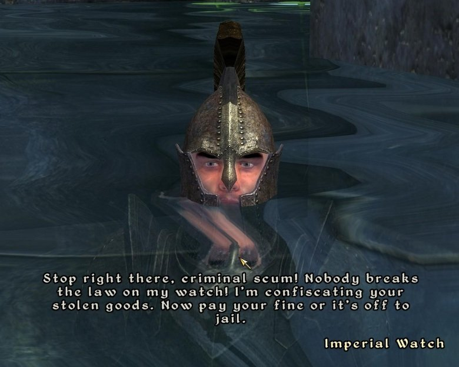
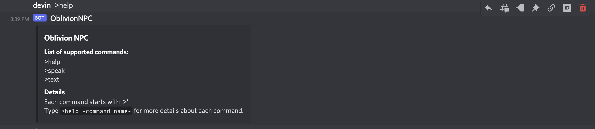
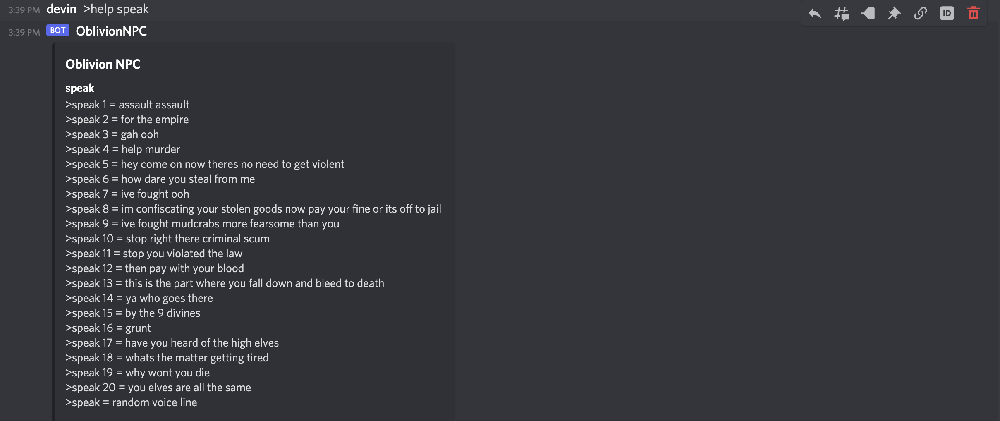
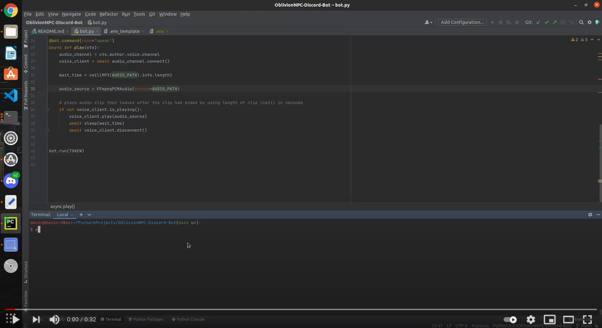

# OblivionNPC-Discord-Bot
a discord bot that comes into your voice channel and will recite oblivion npc dialogue of your choice, because oblivion npc dialogue is hilarious always

  

 
 
 

## Current Progress
* bot responds to '>text' command which writes a hardcoded npc dialogue line
* bot responds to '>speak' command which makes the bot join your current voice channel, recite an npc dialogue line of your choice, and leaves the voice channel
* bot responds to '>help' command

## Demos
### \>help 

### \>help speak 

# 
## \>speak  (random voiceline option)

## Deployment
this bot is deployed on pythonanywhere.com